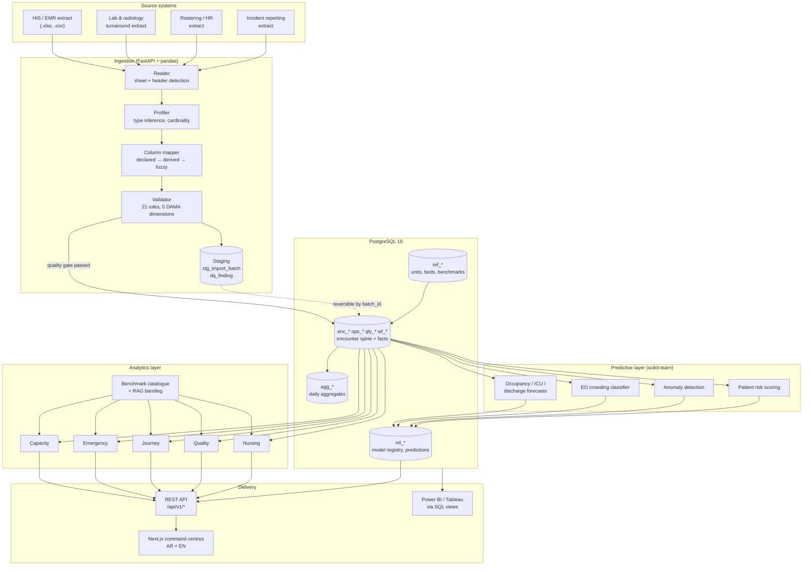
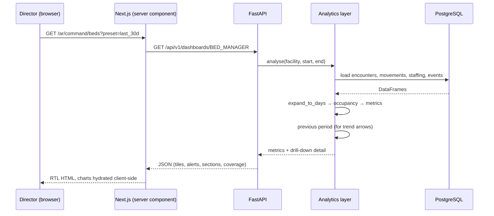
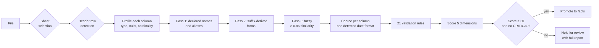

# System architecture

## Shape of the system

The platform is a batch analytics warehouse with a read API and two
front ends (a web UI and direct BI access). It is deliberately **not** an
integration engine: it consumes extracts on a schedule rather than
subscribing to HL7 feeds, because that is what a hospital can supply on
day one without an interface project.

## Why this shape

**Batch, not streaming.** Every hospital that has tried to start a flow
programme with a real-time integration has spent its first year on
interface engineering rather than on flow. Excel extracts are available
the week the project starts. The schema and API are the same either way,
so a later switch to HL7/FHIR ingestion replaces only the reader.

**A staging layer that keeps the source.** `stg_import_batch` records the
file's checksum, the detected column mapping and the full profile;
`dq_finding` records every issue. Any load is reversible by batch id.
When a director disputes a number — and they will — the chain from tile
back to source row is intact.

**One computation, many dashboards.** `analytics/service.analyse()` runs
every metric module once for a period and caches the result. Role
dashboards are projections over that single computation, so the CEO and
the bed manager can never see different values for the same indicator.
This is the failure mode that kills trust in hospital BI faster than any
other.

**Metrics defined twice, on purpose.** The definitions exist in Python
(`app/analytics/`) and in SQL (`db/views.sql`). BI users who bypass the
API get identical numbers, and the duplication is deliberate rather than
accidental.

## Request path

Dashboard fetches run in a server component, so the browser never holds
an API credential and the warehouse host never appears in the bundle.

## Ingestion pipeline in detail

Three points worth knowing:

* **Header detection scans the first 12 rows** and scores each against the
  dataset's known field names. Hospital reports habitually carry a title
  block above the real header.
* **Date format is detected once per column**, then applied vectorised.
  Deciding `03/04/2026` row by row is a coin flip; deciding it from the
  whole column is evidence-based, and it is roughly 5× faster.
* **Rows are quarantined, not batches.** A file with 12 bad rows out of
  40,000 loads the 39,988. Only a missing required *column* is fatal.

## Component boundaries

| Layer | Package | Depends on | Does not know about |
|---|---|---|---|
| Ingestion | `app/ingest/` | `models`, pandas | analytics, ML |
| Repository | `app/analytics/repository.py` | `models`, SQLAlchemy | metric definitions |
| Metrics | `app/analytics/{capacity,ed,journey,quality,nursing}.py` | pandas only | the database |
| Orchestration | `app/analytics/service.py` | repository + metrics | HTTP |
| ML | `app/ml/` | repository + `analytics.ed` | HTTP |
| API | `app/api/` | everything above | pandas internals |

The metric modules take DataFrames and return values. They have no
database imports, which is why the whole metric catalogue is unit-testable
against hand-computed fixtures — and why the test suite runs in 10 seconds
without a database.

## Scaling

| Concern | Approach |
|---|---|
| Wide reporting windows | `agg_metric_day` stores computed values in long format; the API recomputes only what is missing |
| Concurrent dashboards | Stateless API pods behind an HPA; PostgreSQL read replicas for BI |
| Large imports | Streamed to disk, profiled in pandas, promoted in a single flush per dataset |
| Long-horizon trends | Grain is forced to week/month above 120 days rather than timing out |
| Model training | On demand per facility, seconds not hours; artefacts registered in `ml_model` |

Measured on the 120-day, 28,000-encounter reference dataset: full import
of all eleven datasets takes ~100 seconds; a 30-day dashboard including
its previous-period comparison responds in ~7 seconds cold.

## Security and privacy

* MRNs are hashed with a per-deployment salt at ingest. The raw identifier
  never reaches the warehouse, and the salt lives in the secret manager.
* No patient names, national IDs or contact details are in any dataset
  contract — there is nowhere to put them.
* `audit_log` records reads and administrative changes for JCI IMS
  traceability.
* The API refuses to start in production while `HPF_MRN_SALT` is at its
  development default.
* Containers run non-root with a read-only root filesystem; a
  `NetworkPolicy` limits API ingress to the web tier and the ingress
  controller.

## What this platform is not

* **Not a clinical decision support tool.** The patient risk score
  prioritises the flow team's review list. It is not validated for
  individual treatment decisions and is labelled as such in the API
  response and the UI.
* **Not a source of truth for billing or the medical record.**
* **Not a real-time system.** Freshness equals the last import. Every
  dashboard shows its period and generation time.
